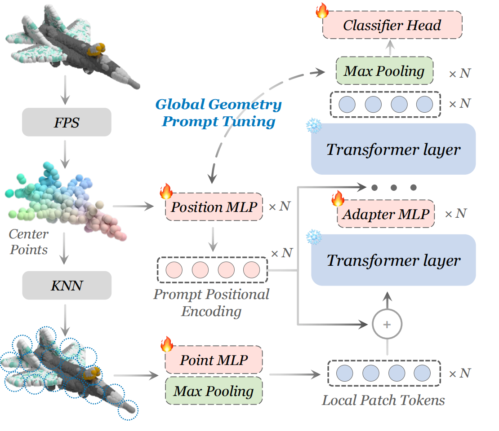

# PPT

## Positional Prompt Tuning for Efficient 3D Representation Learning. [ArXiv](https://arxiv.org/abs/2408.11567)

In this work, we rethink the effect of position embedding in Transformer-based point cloud representation learning methods, and present a novel method of Parameter-Efficient Fine-Tuning(PEFT) tasks based on this as well as a new form of prompt and adapter structure. With less than 5% of the trainable parameters, our method, namely PPT, outperforms its PEFT counterparts in classification tasks on ModelNet40 and ScanObjectNN datasets. Our PPT also gets better or on par results in few-shot learning on ModelNet40 and in part segmentation on ShapeNetPart.

<div  align="center">    
 
</div>

## 1. Requirements
PyTorch >= 1.7.0; python >= 3.7; CUDA >= 9.0; GCC >= 4.9; torchvision;
### Quick Start
```
conda create -n ppt python=3.10 -y
conda activate ppt

conda install pytorch==2.0.1 torchvision==0.15.2 cudatoolkit=11.8 -c pytorch -c nvidia
# pip install torch==2.0.1+cu118 torchvision==0.15.2+cu118 -f https://download.pytorch.org/whl/torch_stable.html

pip install -r requirements.txt
# PointNet++
pip install "git+https://github.com/erikwijmans/Pointnet2_PyTorch.git#egg=pointnet2_ops&subdirectory=pointnet2_ops_lib"
```

## 2. Datasets

We use ScanObjectNN, ModelNet40 and ShapeNetPart in this work. See [DATASET.md](./DATASET.md) for details.

## 3. PPT Models 
| Task              | Dataset        | Config                                                                         | Acc.       | Download                                                                                 |      
|-------------------|----------------|--------------------------------------------------------------------------------|------------|------------------------------------------------------------------------------------------|
| Pre-training      | ShapeNet       | N.A.                                                                        | N.A.       | [here](https://github.com/Pang-Yatian/Point-MAE/releases/download/main/pretrain.pth)     |
| Classification    | ScanObjectNN   | [finetune_scan_hardest.yaml](cfgs/pointmae_configs/finetune_scan_hardest.yaml) | 89.00%     | [here](https://drive.google.com/file/d/1-bXMW9Rgpa549dKummLcvibdzxI50SDR/view?usp=share_link) |
| Classification    | ScanObjectNN   | [finetune_scan_objbg.yaml](cfgs/pointmae_configs/finetune_scan_objbg.yaml)     | 93.63%     | [here](https://drive.google.com/file/d/15YPG0PDtLbKVegpJIClTZpBU9KfL4xIS/view?usp=share_link)   |
| Classification    | ScanObjectNN   | [finetune_scan_objonly.yaml](cfgs/pointmae_configs/finetune_scan_objonly.yaml) | 92.60%     | [here](https://drive.google.com/file/d/11e3sBZDQBgJLUvOF-TxnIJ2sqT7e-b6E/view?usp=share_link) |
| Classification    | ModelNet40(1k) | [finetune_modelnet.yaml](cfgs/pointmae_configs/finetune_modelnet.yaml)         | 93.68%     | [here](https://drive.google.com/file/d/1hpKPV4N0ZkQBIkXDSpYkyDZfClHhpgOi/view?usp=share_link)  |
| Classification    | ModelNet40(8k) | [finetune_modelnet_8k.yaml](cfgs/pointmae_configs/finetune_modelnet_8k.yaml)   | 93.88%     | [here](https://drive.google.com/file/d/1hEFw1Zh3Jkno2od-ez4rPPcbgw-OKNAp/view?usp=share_link)  |
| Part segmentation | ShapeNetPart   | [segmentation](./segmentation)                                                 | 85.7% mIoU | [here](https://drive.google.com/file/d/1XuTI1nBjBcQnU3D2la628LRiZ2aRZfpX/view?usp=share_link)     |

## 4. ReCon Models
| Task              | Dataset        | Config                                                                      | Acc.       | Download                                                                                 |      
|-------------------|----------------|-----------------------------------------------------------------------------|------------|------------------------------------------------------------------------------------------|
| Pre-training      | ShapeNet       | N.A.                                                                        | N.A.       | [here](https://drive.google.com/file/d/1L-TlZUi7umBCDpZW-1F0Gf4X-9Wvf_Zo/view?usp=share_link)     |
| Classification    | ScanObjectNN   | [finetune_scan_hardest.yaml](cfgs/recon_configs/finetune_scan_hardest.yaml) | 89.52%     | [here](https://drive.google.com/file/d/1g_pqJmZBjUBCd-Cw14La1FLZqn-UCRj0/view?usp=share_link) |
| Classification    | ScanObjectNN   | [finetune_scan_objbg.yaml](cfgs/recon_configs/finetune_scan_objbg.yaml)     | 95.01%     | [here](https://drive.google.com/file/d/1qtc9GMH7Q7vyd6-6_VAJ14jgv-Pfh03x/view?usp=share_link)   |
| Classification    | ScanObjectNN   | [finetune_scan_objonly.yaml](cfgs/recon_configs/finetune_scan_objonly.yaml) | 93.28%     | [here](https://drive.google.com/file/d/1YM7txyCs8Yf-FWF2-EcJ04Tj6lfVLJRc/view?usp=share_link) |
| Classification    | ModelNet40(1k) | [finetune_modelnet.yaml](cfgs/recon_configs/finetune_modelnet.yaml)         | 93.76%     | [here](https://drive.google.com/file/d/1WlEFn6k4KC7Ar6kVzyBf9cEwCLfZbjWv/view?usp=share_link)  |
| Classification    | ModelNet40(8k) | [finetune_modelnet_8k.yaml](cfgs/recon_configs/finetune_modelnet_8k.yaml)   | 93.84%     | [here](https://drive.google.com/file/d/16JUNZ6zcRgsZgcuSI2fIBAUiSKfXzSbv/view?usp=share_link)  |
| Part segmentation | ShapeNetPart   | [segmentation](./segmentation)                                              | 85.6% mIoU | [here](https://drive.google.com/file/d/1K-xDMG2tqTBSkHnO7PdelctK5HnVm-30/view?usp=share_link)     |

| Task              | Dataset    | Config                                          | 5w10s Acc. (%) | 5w20s Acc. (%) | 10w10s Acc. (%) | 10w20s Acc. (%) |     
|-------------------|------------|-------------------------------------------------|----------------|----------------|-----------------|-----------------|
| Few-shot learning | ModelNet40 | [fewshot.yaml](cfgs/recon_configs/fewshot.yaml) | 97.0 ± 2.7     | 98.7 ± 1.6     | 92.2 ± 5.0      | 95.6 ± 2.9      |  -->

## 5. PPT Fine-tuning

Fine-tuning on ScanObjectNN, run:
```
CUDA_VISIBLE_DEVICES=<GPUs> python main.py --config cfgs/finetune_scan_hardest.yaml \
--finetune_model --exp_name <output_file_name> --ckpts <path/to/pre-trained/model>
```
Fine-tuning on ModelNet40, run:
```
CUDA_VISIBLE_DEVICES=<GPUs> python main.py --config cfgs/finetune_modelnet.yaml \
--finetune_model --exp_name <output_file_name> --ckpts <path/to/pre-trained/model>
```
Voting on ModelNet40, run:
```
CUDA_VISIBLE_DEVICES=<GPUs> python main.py --test --config cfgs/finetune_modelnet.yaml \
--exp_name <output_file_name> --ckpts <path/to/best/fine-tuned/model>
```
Few-shot learning, run:
```
CUDA_VISIBLE_DEVICES=<GPUs> python main.py --config cfgs/fewshot.yaml --finetune_model \
--ckpts <path/to/pre-trained/model> --exp_name <output_file_name> --way <5 or 10> --shot <10 or 20> --fold <0-9>
```
Part segmentation on ShapeNetPart, run:
```
cd segmentation
python main.py --ckpts <path/to/pre-trained/model> --root path/to/data --learning_rate 0.0002 --epoch 300
```

## Acknowledgements

Our codes are built upon [Point-MAE](https://github.com/Pang-Yatian/Point-MAE) and [ICCV23-IDPT](https://github.com/zyh16143998882/ICCV23-IDPT?tab=readme-ov-file)

## Reference

```

```
